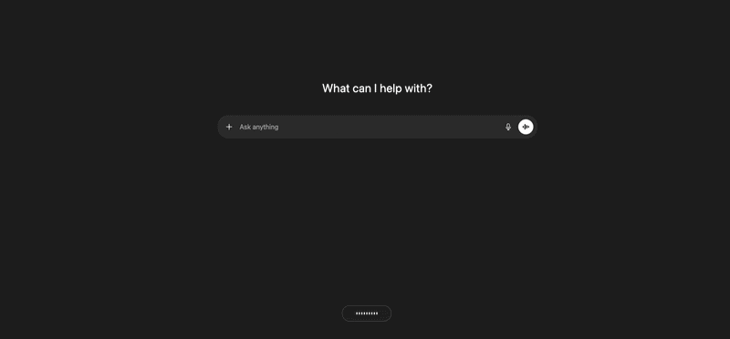
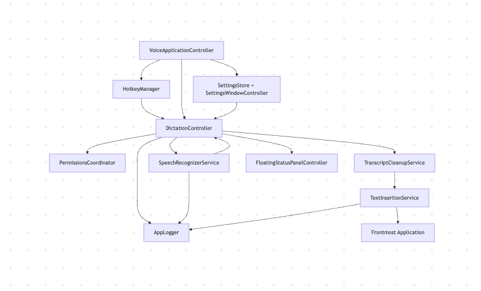

# voice

`voice` is a macOS menu bar dictation app built for fast cross-application speech-to-text workflows.

It focuses on practical engineering use cases:
- global hotkey start/stop
- live transcript + cleanup
- direct paste into the active app
- reliable clipboard fallback when direct insertion is blocked

## Demo



## Features

- Global hotkey dictation (`⌥Space` and `fn`)
- `Toggle` and `Push-to-Talk` recording behavior
- Apple Speech transcription profiles:
  - `Apple Speech (Automatic)`
  - `Apple Speech (On-Device Preferred)`
- Transcript cleanup pipeline (filler removal, punctuation, capitalization)
- Smart insertion strategy:
  - direct paste when possible
  - typed fallback when needed
  - clipboard fallback as safety net
- Floating status UI (`Listening`, `Processing`, final states)
- Logs + diagnostics from the menu bar

## Requirements

- macOS `13+`
- Swift toolchain compatible with `swift-tools-version: 6.2`
- Xcode Command Line Tools installed
- Interactive GUI session (not headless/SSH)
- Permissions:
  - Microphone
  - Speech Recognition
  - Dictation enabled in macOS Keyboard settings
  - Accessibility (for cross-app insertion)

## Tech Stack

- Language: `Swift`
- App framework: `AppKit`
- Audio capture: `AVFoundation` (`AVAudioEngine`)
- Speech recognition: `Speech` framework (`SFSpeechRecognizer`)
- Global hotkeys: `Carbon` + `NSEvent`
- Accessibility + automation: `ApplicationServices` (`AXUIElement`, `CGEvent`)
- Packaging: shell script (`scripts/package-app.sh`)

## Architecture



[Open architecture image](assets/Architecture.png)

## Install (Local Build)

1. Clone the repo.
2. Build:
   ```bash
   swift build
   ```
3. Package as a signed `.app` bundle:
   ```bash
   ./scripts/package-app.sh
   ```
4. Launch:
   ```bash
   open dist/voice.app
   ```

## Install (Binary Release)

If you distribute binaries (for example via GitHub Releases):

1. Download `voice.app.zip`.
2. Move `voice.app` to `/Applications`.
3. Open it once from Finder.
4. Grant requested permissions.
5. Use `⌥Space` (or `fn`) to dictate in any text field.

## First-Run Setup

1. Open `voice.app`.
2. Grant:
   - Speech Recognition
   - Microphone
   - Accessibility
3. Confirm dictation is enabled:
   - `System Settings > Keyboard > Dictation`

## Usage

- Start/stop dictation: `⌥Space` or `fn`
- Open settings: menu bar -> `Settings...`
- Configure:
  - Hotkey behavior (`Toggle` / `Push-to-Talk`)
  - Transcription profile
  - Insertion mode (`Direct Paste` / `Clipboard Only`)

## Logs & Diagnostics

- Log file: `~/Library/Logs/voice/voice.log`
- Menu actions:
  - `Open Logs Folder`
  - `Log Environment Diagnostics`
  - `Run Notes/TextEdit Insertion Probe`
  - `Copy TCC Log Command`
  - `Re-check Accessibility Status`

TCC stream command:

```bash
log stream --debug --predicate 'subsystem == "com.apple.TCC" AND eventMessage CONTAINS "voice"'
```

## Troubleshooting

If insertion fails:

1. Quit `voice`.
2. Ensure only one `voice.app` copy is installed.
3. Remove stale `voice` entries from Accessibility settings.
4. Relaunch `dist/voice.app` and re-grant permissions.
5. Validate in `Notes` or `TextEdit` before testing in IDE/browser apps.

## Project Structure

- `Sources/voice/VoiceApplicationController.swift`: app composition + menu bar wiring
- `Sources/voice/DictationController.swift`: dictation state machine and flow
- `Sources/voice/SpeechRecognizerService.swift`: Apple Speech engine + stop/finalize logic
- `Sources/voice/TextInsertionService.swift`: accessibility-aware insertion pipeline
- `Sources/voice/Settings*`: preferences state + UI
- `scripts/package-app.sh`: release-style `.app` packaging + signing

## Security & Privacy Notes

- No API keys are required.
- Speech transcription uses Apple Speech framework.
- Text is inserted locally into the active app; clipboard fallback is explicit and logged.
